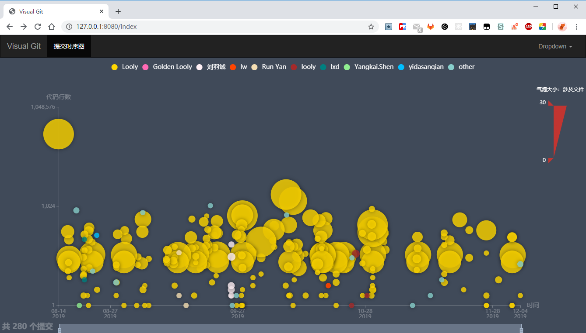
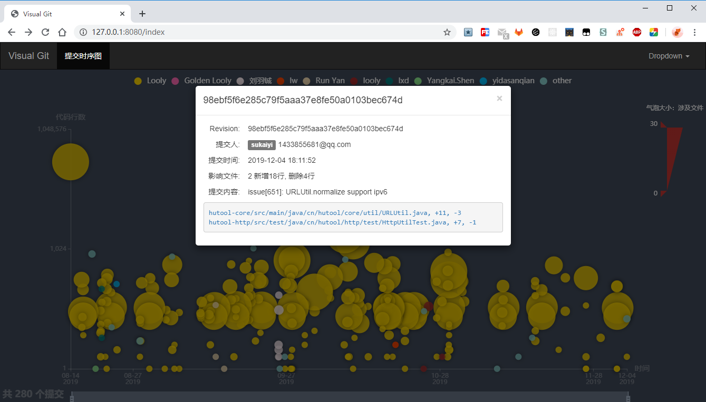

# Visual Git

> 根据 git 提交历史生成统计图表

---
### 一、使用环境
`java8 & git`


### 二、安装
```bash
git clone git@github.com:sukaiyi/visualgit.git
cd visualgit
mvn clean package -Dmaven.test.skip=true
cd target
java -jar visual-git-1.0-SNAPSHOT-shaded.jar <repoPath>
```

然后浏览器打开 [http://127.0.0.1:8080/index]( http://127.0.0.1:8080/index)

### 三、效果图


